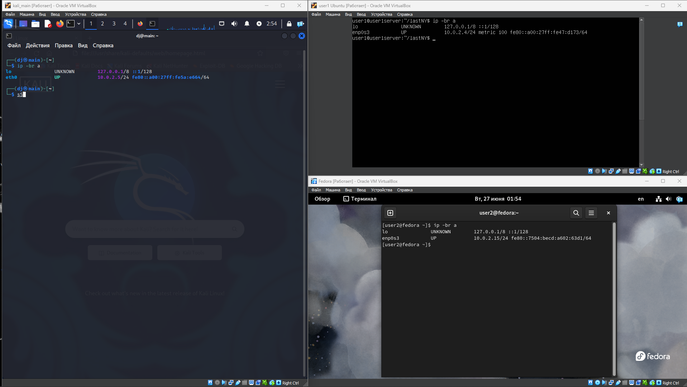
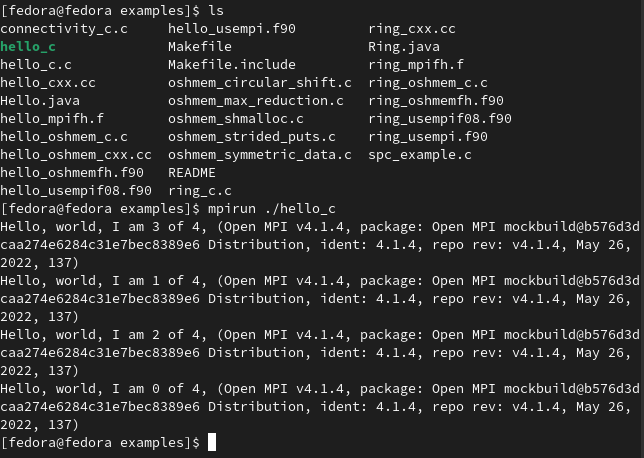
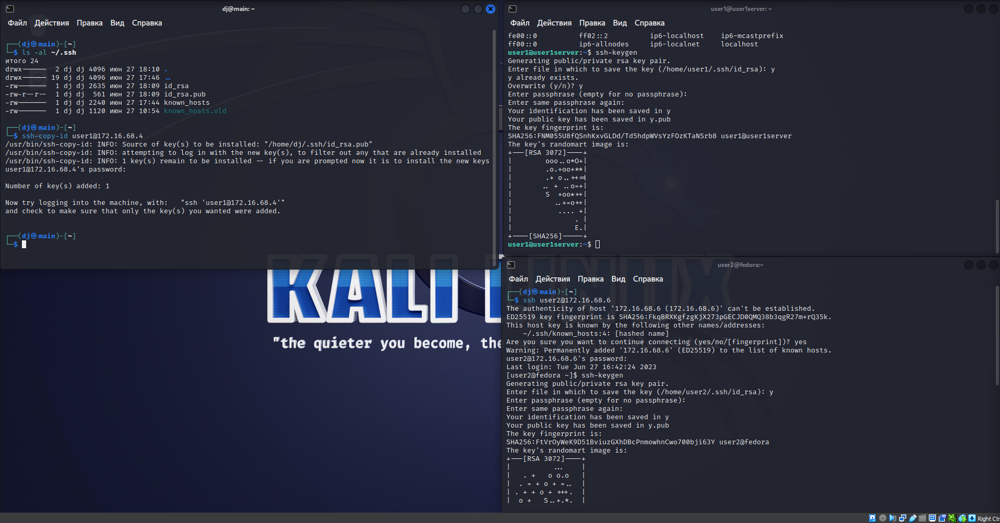
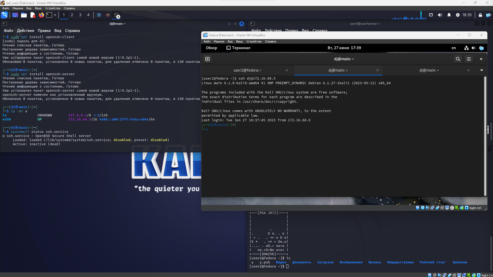

# parallel-comp-linux

# САНКТ-ПЕТЕРБУРГСКИЙ ГОСУДАРСТВЕННЫЙ ПОЛИТЕХНИЧЕСКИЙ УНИВЕРСИТЕТ им. ПЕТРА ВЕЛИКОГО
## Институт компьютерных наук и технологий
### Высшая школа искусственного интеллекта

Научно-исследовательская работа

Тема: Технологии параллельного программирования в операционных системах Linux

---
Работу выполнил:  
Рябинин А. Д.  
Студент группы: 3530201/10001

Проверил:  
Чуватов М.В.

Санкт-Петербург - 2023 г.
---

1. изучение работы vb 

---

1. установлен VB
2. создана NAT сеть с включенным DHCP 
3. созданы 3 виртуальные машины
   1. kali linux
       - kali GNU/Linux Rolling 
       - версия 2023.2
       - ram 2 Db
      
   2. ubuntu server
      -  ubuntu 22.04.2 LTS
      -  ram 2 Gb
      
   3. fedora releas 38
       - ram 4 GB
       - Dam 25 GB
  
4. Определены ip для каждой машины с помощью `ip -br a` \
   Команда `ip -br a` является командой для вывода информации о сетевых интерфейсах в кратком формате с использованием инструмента `ip` в Linux. Здесь `-br `означает "краткий" и "сокращенный" формат вывода информации, а `a` обозначает "адреса" (addresses).\
     Когда вы выполняете команду `ip -br a`, вы получаете список сетевых интерфейсов и их свойств\
    
      

5. Осуществлена проверка связи между дистрибутивами с помощью `ping`\
    Команда `tcpdump -i enp0s3 icmp `используется для захвата и отображения сетевых пакетов протокола ICMP (Internet Control Message Protocol) с помощью утилиты `tcpdump` в Linux.\
    Вот что делает каждая часть этой команды:

    tcpdump: это утилита командной строки, которая позволяет захватывать, анализировать и отображать сетевые пакеты на Linux.
    `-i enp0s3`: параметр `-i `указывает tcpdump на интерфейс, с которого нужно захватывать пакеты. Здесь `enp0s3` - это имя сетевого интерфейса, с которого будут захватываться пакеты. 
    `icmp`: это фильтр, указывающий tcpdump захватывать только пакеты протокола ICMP. ICMP используется для передачи контрольных сообщений и ошибок в сети, например, при выполнении команды ping.

    Таким образом, команда `tcpdump -i enp0s3 icmp` будет захватывать только пакеты протокола ICMP, проходящие через сетевой интерфейс `enp0s3` и выводить их в консоль. Это полезно, когда вам нужно наблюдать ICMP-пакеты, такие как запросы и ответы ping, или для отладки сетевых проблем, связанных с протоколом ICMP.

    Связь работает
    

6. сравнительная таблица дистрибутивов
    |     Отличие       |   Kali Linux   |    Ubuntu    |    Fedora     |
    |-------------------|----------------|--------------|---------------|
    | Основан на        | Debian         | Debian       | Red Hat       |
    | Направленность    | Кибербезопасность, тестирование на проникновение | Общеприменяемый, разработка, рабочие станции | Общеприменяемый, серверы, настольные компьютеры |
    | Версии релизов    | Rolling Release | LTS и Regular| Regular       |
    | Поддержка         | Ограниченная    | Длительная   | Длительная    |
    | Целевая аудитория | Этичные хакеры, пентестеры, специалисты по информационной безопасности | Широкий круг пользователей, разработчики, рабочие станции | Широкий круг пользователей, серверы, настольные компьютеры |
    | Программное обеспечение | Инструменты для тестирования на проникновение, аудита безопасности и разработки | Широкий выбор программного обеспечения и библиотек | Широкий выбор программного обеспечения и библиотек |
    | Процесс установки | Гибкая настройка пакетов и инструментов по умолчанию для кибербезопасности | Установка с выбором пакетов и возможностью настройки | Установка с выбором пакетов и возможностью настройки |
    | Пользовательский интерфейс | GNOME | Различные варианты, включая GNOME, KDE, Xfce, и другие | GNOME, KDE, Xfce, и другие |
    | Коммерческая поддержка | Доступна через Offensive Security | Доступна через Canonical | Некоторая коммерческая поддержка доступна через Red Hat |
    | Официальные ветки | Kali Linux, Kali Linux Light, Kali Linux ARM | Ubuntu, Ubuntu Server, Ubuntu Core, Ubuntu Studio, и другие | Fedora Workstation, Fedora Server, Fedora IoT, и другие |
7. Для подключения по ssh был сгенерированы ключи.
   генерация ключей ssh выполняется командой: ` ssh-keygen`
   Секретный ключ будет называться id_rsa, а публичный id_rsa.pub.
   Затем утилита предложит ввести пароль для дополнительного шифрования ключа на диске. Его можно не указывать, если не хотите. Использование дополнительного шифрования имеет только один минус - необходимость вводить пароль, и несколько преимуществ:

       - Пароль никогда не попадет в сеть, он используется только на локальной машине для расшифровки ключа. Это значит что перебор по паролю больше невозможен.
        - Секретный ключ хранится в закрытом каталоге и у клиента ssh нет к нему доступа пока вы не введете пароль;
        - Если злоумышленник хочет взломать аутентификацию по ключу SSH, ему понадобится доступ к вашей системе. И даже тогда ключевая фраза может стать серьезной помехой на его пути.
   

   Для проверки наличия ключа используем команду `ls -al ~/.ssh`
   Необходимо чтобы в каталоге были файлы id_rsa и id_rsa.pub

   Для копирования  ключа на удаленный сервер воспользуемся ` ssh-copy-id username@remote_host`. 
   
   Вход по ssh ключу в ubuntu server 
   

    Подключаемся в обратную сторону. С ubuntu в kali 
    
8.  asd
9.  as
10. 
11. 

  

