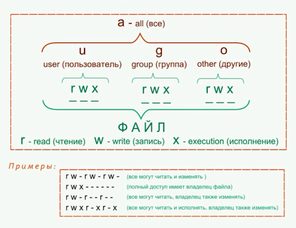
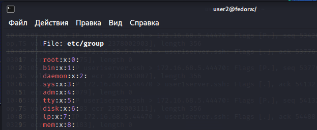

Поскольку наша дисциплина называется «Научно-исследовательская работа», она 
предполагает в большей степени самостоятельное изучение определённой темы.

**Задача 0**: установка и настройка среды виртуализации VirtualBox.

Здесь необходимо научиться создавать, удалять и настраивать виртуальные машины, сетевое 
окружение и распределять доступные вычислительные ресурсы.

- [ ] Нам потребуется сеть NAT с адресом, указанным напротив вашей фамилии в высланной ранее 
таблице, 
- [ ] для этой сети необходимо выключить DHCP (автоматическую настройку сетевого 
интерфейса), 

- [ ] а в настройках создаваемых виртуальных машин на вкладке «Сеть» необходимо 
выбрать для первого сетевого адаптера тип сети «Сеть NAT», в противном случае наши узлы 
либо не смогут общаться между собой, либо не смогут обратиться к внешним сетевым 
ресурсам, либо они окажутся включёнными в сеть вашего физического компьютера, что 
потребует изменения схемы адресации, а конфигурация окажется «привязанной» к вашей 
сети, где вы выполняли первоначальную настройку. Остальные сетевые адаптеры на вкладке 
«Сеть» необходимо выключить, чтобы не создать путаницу и не усложнить себе жизнь.

Задача 1: установка ОС и базовая настройка сети.

В-шестых — сеть: уже на этапе установки можно полностью настроить сетевой интерфейс 
таким образом, чтобы получить работоспособную сетевую конфигурацию и к этому вопросу 
больше не возвращаться. 
- [ ] Для этого необходимо помнить, что из диапазона адресов вашей сети NAT первый адрес узла всегда будет занят виртуальным маршрутизатором VirtualBox, и он же является адресом шлюза по-умолчанию и адресом сервера DNS. Поэтому адреса, 
которые вы будете назначать вашим узлам, не должны пересекаться, совпадать с адресом 
шлюза и адресом широковещательной рассылки. Также в установщике потребуется указать 
имена узла и домена. несмотря на то, что имя домена указывать не обязательно, я советую это 
сделать. Имя домена для всех узлов в вашей виртуальной сети должно быть одинаковым, а 
имена узлов — уникальными. Если всё сделано правильно — сеть между работающими 
узлами можно будет проверить командой ping с указанием ip-адреса узла, к которому вы 
обращаетесь. Для разрешения доменных имён необходимо будет выполнить дополнительные 
действия.

- [ ] Задача 2: изучение базовых возможностей взаимодействия с ОС Линукс.

- [x] Изучите основную иерархию файловой системы (верхний уровень, начиная от корня), какие 
каталоги для чего используются, 
- [x] где расположены домашние каталоги пользователей и 
суперпользователя, 

файлы root

    В Linux, корневой каталог (root) является верхним уровнем иерархии файловой системы. Вот некоторые из основных каталогов в корневом каталоге Linux и их предназначение:

    /bin:
    Этот каталог содержит исполняемые файлы (бинарные файлы), которые могут использоваться пользователями и системными процессами во время нормальной работы.

    /boot:
    Здесь хранятся файлы, связанные с загрузкой системы. Это включает в себя ядро (kernel), конфигурационные файлы загрузчика и другие файлы, необходимые для процесса загрузки системы.

    /dev:
    В этом каталоге находятся специальные файлы устройств (device files), представляющие различные физические и виртуальные устройства, такие как жесткие диски, терминалы, принтеры и другие.

    /etc:
    Этот каталог содержит конфигурационные файлы системы. Здесь находятся файлы с настройками сети, пользователей, служб, запуска и другие файлы, которые управляют поведением системы.

    /home:
    Каталог /home содержит домашние каталоги пользователей. Каждый пользователь имеет свой собственный подкаталог здесь, где хранятся его личные файлы и настройки.

    /lib и /lib64:
    Эти каталоги содержат библиотеки (shared libraries), которые используются программами во время выполнения. /lib предназначен для 32-битных систем, а /lib64 - для 64-битных систем.

    /media:
    Каталог /media используется для автоматического монтирования съемных носителей, таких как USB-флэшки, CD/DVD-диски и другие.

    /opt:
    В этом каталоге могут находиться дополнительные программы и пакеты, которые не являются частью основной системы. Обычно они устанавливаются сторонними поставщиками.

    /tmp:
    Каталог /tmp предназначен для временных файлов, используемых приложениями и процессами. Файлы, размещенные здесь, могут быть удалены при перезагрузке системы.

    /usr:
    Каталог /usr содержит файлы и программы, предназначенные для общего использования. Здесь находятся системные библиотеки, заголовочные файлы, исполняемые файлы, документация и другие ресурсы.

    /var:
    В этом каталоге хранятся данные, которые изменяются во время работы системы. Это может включать журналы системы, базы данных, временные файлы и т. д.

    /mnt:
    Каталог /mnt предназначен для временного монтирования файловых систем. Обычно он используется для временного подключения внешних носителей, таких как USB-флэшки, внешние жесткие диски и сетевые ресурсы. Когда файловая система монтируется в /mnt, ее содержимое становится доступным для чтения и записи в этом месте.

    /proc:
    Каталог /proc представляет виртуальную файловую систему, которая предоставляет информацию о текущих процессах и системе в целом. Файлы и подкаталоги в /proc представляют системные ресурсы, такие как процессы, память, сеть, файловые системы и другие. Они могут быть использованы для мониторинга и настройки системы.

    /run:
    Каталог /run содержит временные файлы и каталоги, создаваемые системой во время запуска. Он является заменой для /var/run, который используется в более старых версиях Linux. /run содержит информацию о работающих сервисах, идентификаторы процессов (PID), сокеты и другие временные данные, которые требуются во время работы системы.

    /sbin:
    Каталог /sbin содержит системные исполняемые файлы (бинарные файлы), которые обычно используются администраторами системы для выполнения системных задач. В этом каталоге находятся утилиты и команды, которые могут быть выполнены только с правами суперпользователя (root), такие как управление сетью, системный запуск и т. д.

    /srv:
    Каталог /srv предназначен для хранения данных, специфичных для определенных сервисов или проектов. Он используется для размещения файлов, которые обслуживаются или используются различными службами или приложениями на сервере. Например, веб-сервер может хранить свои веб-сайты в /srv/www, а FTP-сервер может использовать /srv/ftp для хранения файлов пользователей.
    
    В каталоге /root находится домашний каталог суперпользователя (root) в операционной системе Linux. В этом каталоге располагаются файлы и настройки, связанные с учетной записью root. Некоторые из файлов и каталогов, которые можно найти в /root, включают:

    Конфигурационные файлы:
    В /root могут находиться различные конфигурационные файлы, связанные с системными параметрами и настройками root. Это могут быть файлы, такие как .bashrc, .bash_profile или .profile, которые определяют переменные среды и настройки командной оболочки (shell) для root.

    Системные скрипты:
    В /root могут храниться системные скрипты, которые выполняются суперпользователем или используются для автоматизации определенных задач. Это могут быть скрипты для резервного копирования, обслуживания системы, настройки сети и других системных операций.

    Журналы системы:
    Некоторые системные журналы (логи) могут быть размещены в /root. Это могут быть файлы журналов, которые содержат записи о системных событиях, ошибках, 

- [x] какие права у пользователя для работы с файлами в своём домашнем 
каталоге и в других каталогах.

В каталоге home можем увидеть файлы нашего пользователя.
Покажем все скрытые файлы 

файлы, начинающиеся с . скрыты.
- [x] Ознакомьтесь с атрибутами файлов и каталогов, 
Атрибуты файлов и каталогов - это свойства или параметры, которые могут быть назначены файлам и каталогам в файловой системе. Они предоставляют информацию о различных аспектах файла или каталога, таких как права доступа, владелец, группа, время создания и изменения, размер, тип файла и другие характеристики. Атрибуты используются для управления доступом к файлам, управления их свойствами и определения их роли в системе.

Атрибуты файлов и каталогов в системе Linux включают:

    Права доступа:
    Права доступа определяют, какие операции могут быть выполнены с файлом или каталогом, и кто может выполнять эти операции. Права доступа могут быть разделены на три категории: владелец файла, группа и остальные пользователи. В рамках каждой категории могут быть заданы разрешения на чтение, запись и выполнение.

    Владелец и группа:
    Каждый файл и каталог имеет владельца и группу. Владелец обычно является создателем файла или каталога и имеет определенные привилегии для управления им. Группа определяет набор пользователей, которые могут иметь общий доступ к файлу или каталогу и управлять им.

    Время создания и изменения:
    Атрибуты времени, такие как время создания (ctime), время изменения содержимого (mtime) и время изменения метаданных (atime), указывают на время, когда файл или каталог были созданы, изменены или доступны для чтения.

    Размер:
    Размер атрибута указывает на общий размер файла или каталога в байтах или других единицах измерения.

    Тип файла:
    Атрибут типа файла указывает на тип содержимого файла, такой как обычный файл, каталог, символическая ссылка, устройство и другие.

    Скрытый атрибут:
    Некоторые файлы и каталоги могут иметь скрытый атрибут, который делает их невидимыми в стандартных просмотрах файловой системы. Скрытые файлы и каталоги обычно начинаются с точки (например, .hiddenfile).

Атрибуты файлов и каталогов используются операционной системой для эффективного управления файловой системой, безопасности данных и обеспечения правильного функционирования системы.

Есть 3 типа прав. Право на чтение, запись и исполнение (read write execution)

Есть 3 типа доступа: для пользователя, для группы пользователя, для других

По умолчанию файлы в каталоге пользователя имеют данные привелении.

Для операционной системы разницы какое расширение у файла. Они испотльзуюся только в приложениях. 
Права состоят из 9 битов. Визуально они представляются перед файлом как последовательность из 9 букв, где первая может быть тольок d - директория. дальше 3 группы по 3 символа rwx.

Для файлов:
    право r - возможность прочитать файл
    право w - возможность записать в файл
    право x - возможность исполнить файл в командной оболочке

так как директории это тоже файлы с признаком d.
В таком файле хранятся название вложеных файлов, ссылки и права
Для директорий: 
    право r - возможность изнать список файлов в директории `ls ...`
    право w - возможность записать в файл
    право x - возможность войти в эту директорию `cd ...`

Права записываются как 3 числа в 8ричной системе счисления 
    111 010 101
    7   2   5
    право r - 4
    право w - 2
    право х - 1
    
- [x] Ознакомьтесь с понятиями групп и пользователей в ОС Линукс, с тем, как работать с разрешениями на файлы и каталоги.

Linux - многопользовательский многозадачная система. В системе реализованы разные права  пользователя и разграничение до ресурсов системы. 
Имя пользователя linux может быть строкой до 32 символов.
Имя это только псевдоним, значим только для пользователя.
Сама система представляет всех пользователей с помощью UID - user identified - числовое поле от 0 до 2^32-1
Система по псевдоному ищет UID и работает с ним.

Пользователь  root имеет  UID = 0 и не имеет никакких ограничений в доступе к ресурсам компьютера.
остальные пользователи раздаляются на служебных и на люычных пользователей. 
Служебные - демоны, компьютерная программа, работающая в фоновом режиме.

Операционная система хранит о пользователях в файле `/etc/passwd`. 

Kаждая строка - пользователь. 
У нас первай строк - пользоватеь root
Последняя строка - пользователь user2
Рассмотрим строку пользователя: 
    первый столбец - имя пользователя - root
    сторой столбец - х (тут был раньше пароль)
    третий столбец - UID
    четвертый столбец - GID (group identifer) (по умолчанию UID = GID)
    пятый  столбец - комментарий к пользователю
    шестой столбец - домашнаяя директория пользователя 

Операционная система хранит о группах в файле `/etc/group`. 

Тут есть только информация о имени группы, ее id и входящих в нее пользователей.
Узнать информацию о том в какие группы входит пользователь можно с помощтю команды `id <ligin>`

Для добавление пользователя в группу необходимо использовать `usermod` 

Команда `sudo usermod -aG <group_name> <user_name>` добавит пользователя в группу.

- [ ] Следующим достижением должно стать выполнение основных задач пакетного менеджера: 
установка, удаление пакета, обновление списка пакетов и обновление версий установленного ПО.

В fedora используется Dnf менеджер, который является форком  Yum

Для установки пакетов используется команда ` dnf install <имя пакета>`.
Для поиска в репозитории `dnf search <search term>`
Для удаления пакета `dnf remove <packagename>`
Для обновления пакета `dnf update <packagename>`
Для обновления всех пакетов `dnf update `

Установим Bat — это клон команды cat с дополнительной разметкой и подсветкой синтаксиса для большого количества языков программирования, а также интеграцией Git для отображения изменений файлов.

Установка

Используем 

Обновим все пакеты

Удалим Bat

Здесь же необходимо познакомиться с понятием «зависимость»: почему в ряде случаев 
мы не можем установить произвольную версию пакета, а получаем сообщение об ошибке с 
выводом версий других установленных пакетов.

 Здесь вы можете проверить, установлен ли уже в вашей системе ssh-сервер и клиент, установлен ли компилятор gcc, библиотеки для разработки и запуска параллельных приложений openmp и openmpi. 

Зависимости пакетов в Linux - это требования, которые один пакет (называемый пакетом "зависимости") предъявляет к другим пакетам, необходимым для его правильной установки и функционирования. Зависимости помогают обеспечить целостность и согласованность установки пакетов в Linux-системе.

Существуют два основных типа зависимостей пакетов:

   **Зависимости библиотек**: Некоторые пакеты требуют определенных библиотек для своей работы. Это могут быть различные библиотеки, такие как библиотеки C, библиотеки для работы с графикой, базы данных и т. д. Зависимости библиотек обеспечивают наличие необходимых компонентов, чтобы пакет мог успешно скомпилироваться, запуститься и работать правильно.

    **Зависимости пакетов**: Некоторые пакеты могут зависеть от других пакетов, которые предоставляют определенные функциональные возможности или программные компоненты. Например, пакет для работы с графическим интерфейсом может зависеть от пакета X Window System, а веб-сервер может зависеть от пакета для поддержки PHP или Python. Зависимости пакетов гарантируют, что все необходимые компоненты будут установлены и доступны для использования.

Зависимости пакетов управляются пакетными менеджерами в Linux, которые автоматически устанавливают все необходимые зависимости при установке пакета. Это упрощает процесс установки и обновления программного обеспечения, поскольку пакетный менеджер самостоятельно следит за удовлетворением всех зависимостей. Если необходимые зависимости отсутствуют или несовместимы, пакетный менеджер может выдать сообщение об ошибке или предложить варианты установки или обновления пакетов для удовлетворения зависимостей.

Уже установлен openssh-server openssh-client 

Уже установлен gcc

- [x] Часто в процессе изучения ОС Линукс вам придётся обращаться к файлам журналов ошибок. 
Поэтому изучите, в какие файлы пишутся эти журналы, где эти файлы расположены, как 
правильно с ними работать.

В Linux, файлы журналов ошибок обычно находятся в директории /var/log. Эта директория содержит различные системные журналы, в которых регистрируются события, ошибки и предупреждения.

Наиболее часто используемых файлов журналов ошибок в Linux:

    /var/log/syslog: Общий системный журнал, который содержит сообщения о системных событиях, ошибках и предупреждениях.
    /var/log/messages: Журнал системных сообщений, включающий сообщения ядра и других сервисов.
    /var/log/auth.log: Журнал аутентификации, который содержит информацию об авторизации и аутентификации пользователей.
    /var/log/kern.log: Журнал ядра, который содержит сообщения ядра, связанные с работой и ошибками.
    /var/log/dmesg: Журнал сообщений ядра, который содержит вывод команды dmesg и информацию о загрузке системы.
    /var/log/boot.log: Журнал загрузки системы, содержащий информацию о процессе загрузки.
    /var/log/cron: Журнал выполнения задач по расписанию (cron).
    /var/log/nginx/error.log: Журнал ошибок веб-сервера Nginx.
    /var/log/apache2/error.log: Журнал ошибок веб-сервера Apache.

Файл с логами boot.log

В большинстве случаев более удобными и информативными инструментами являются команды less или tail. Команда less позволяет просматривать содержимое файла постранично и искать ключевые слова.

Фильтрация и поиск: Для более точного анализа или поиска определенных сообщений в файлах журналов можно использовать инструменты фильтрации и поиска, такие как grep. Например, чтобы найти все строки с определенным ключевым словом "error", можно выполнить следующую команду: `grep "error" /var/log/boot.log`

Возможно использование специализированных инструментов: Для удобства работы с журналами ошибок в Linux существуют специализированные инструменты, такие как journalctl для систем, использующих systemd. Команда journalctl позволяет просматривать, фильтровать и анализировать журналы системных событий, включая журналы ошибок.

`journalctl -u nginx.service --since "1 hour ago"`
Эта команда отобразит журналы ошибок для службы Nginx за последний час.

Возможно использование графических интерфейсов: Для более удобной работы с файлами журналов ошибок существуют графические интерфейсы, такие как gnome-system-log, KSystemLog и другие, которые предоставляют удобный просмотр и фильтрацию журналов с помощью графического интерфейса.

- [ ] Задача 3: завершение настройки сети.

- [ ] Для обращения к другим узлам вашей виртуальной сети по их именам, а не ip-адресам, 
необходимо настроить разрешение имён. Сделать это можно несколькими способами, но мы 
воспользуемся самым простым из них: перечислим имена и сопоставим им адреса в файле 
/etc/hosts. 

Изучите, что это за файл, как возможно с его помощью разрешать имена узлов без 
настройки сервера службы DNS, каким образом добавлять и удалять записи в этом файле и 
каков формат этих записей. 
После успешной настройки (на каждом узле в файле hosts должны быть перечислены все остальные узлы) вы сможете обратиться к другому узлу командой ping уже с указанием имени узла, а не его ip-адреса.

    Для добавления записи в файл /etc/hosts можно использовать консольный редактор nano. 
`sudo nano /etc/hosts`

Добавим строчки \
    72.16.68.4 user1ubuntu \
    172.16.68.5 user3kali

- [x] На этом же этапе необходимо установить ssh-сервер и клиент, если они ещё не установлены, 
разобраться, что такое авторизация по ключу, выяснить, каким образом можно сгенерировать 
пару ключей и где они должны быть размещены, чтобы служба ssh могла использовать их для 
авторизации при подключении к другому узлу. Пару ключей необходимо будет сгенерировать 
для учётной записи обычного пользователя на каждом узле и один из ключей правильным 
образом разместить на других узлах, чтобы с каждого узла можно было подключиться ко всем 
остальным узлам.

Для подключения по ssh используется openssh-server и openssh-client.

Для подключения по ssh был сгенерированы ключи.
   генерация ключей ssh выполняется командой: ` ssh-keygen`
   Секретный ключ будет называться id_rsa, а публичный id_rsa.pub.
   Затем утилита предложит ввести пароль для дополнительного шифрования ключа на диске. Его можно не указывать, если не хотите. Использование дополнительного шифрования имеет только один минус - необходимость вводить пароль, и несколько преимуществ:

       - Пароль никогда не попадет в сеть, он используется только на локальной машине для расшифровки ключа. Это значит что перебор по паролю больше невозможен.
        - Секретный ключ хранится в закрытом каталоге и у клиента ssh нет к нему доступа пока вы не введете пароль;
        - Если злоумышленник хочет взломать аутентификацию по ключу SSH, ему понадобится доступ к вашей системе. И даже тогда ключевая фраза может стать серьезной помехой на его пути.
   

   Для проверки наличия ключа используем команду `ls -al ~/.ssh`
   Необходимо чтобы в каталоге были файлы id_rsa и id_rsa.pub

   Для копирования  ключа на удаленный сервер воспользуемся ` ssh-copy-id username@remote_host`. 
   
   Вход по ssh ключу в ubuntu server 
   

    Подключаемся в обратную сторону. С ubuntu в kali 
   

Вход по ssh ключу и имени хоста 

- В kali 
  - 
- В ubuntu 
  - 

- [ ] Задача 4: подготовка среды разработки.

- [ ] В качестве универсальной среды разработки начального уровня предлагается использовать 
простой текстовый редактор (vim, nano, ee...) в сочетании с компилятором gcc, запускаемым 
из командной строки. Для разработки параллельных программ потребуется установить gcc 
(если он ещё не установлен) и пакеты openmp и openmpi. Отдельно изучите, какие именно 
пакеты необходимо установить для исполнения и для сборки приложений, использующих эти 
технологии. Как правило, компоненты среды исполнения поставляются в одних пакетах, а 
разработки — в других.

- [ ] Помимо установки пакетов, может потребоваться некоторая настройка пользовательского 
окружения. Для этого необходимо познакомиться с понятием переменных окружения, чтобы 
иметь возможность создавать и присваивать значения этим переменным, добавлять значения к 
существующим системным переменным, устанавливать их значения автоматически при входе 
пользователя в систему или иметь возможность установить их только на этапе запуска 
определённого приложения.

- [ ] После этого необходимо проверить работоспособность такой среды разработки и исполнения 
на простых примерах, которые можно разработать самостоятельно или найти в сети — в 
данном случае это не принципиально. Исходный текст программы на C++ формируется в 
текстовом редакторе и сохраняется в файл, затем компилятором из этого текста собирается 
исполнимый файл, который затем запускается и демонстрирует работу в несколько потоков 
и/или на нескольких вычислительных узлах. Дополнительно нужно изучить особенности 
запуска MPI-приложений.

- [ ] Задача 5: портирование приложения из лабораторной работы по теории графов.

Задание из лабораторной работы 0 по теории графов вам необходимо осмыслить и переписать 
на C++ с использованием технологии MPI. Причём, в данном случае принципиально важным 
является факт распараллеливания задачи и параллельное исполнение, а не получение 
максимальной производительности. Поэтому вопросы оптимизации здесь не затрагиваются. 
Исследуйте задание на предмет выявления тех её частей, которые могут исполняться 
параллельно. Например, можно ли и как распараллелить работу генератора, аналогично — 
кодировщика, декодировщика, каким образом можно распараллелить свой алгоритм сжатия…

Конечным итогом должна стать программа, реализующая ваше задание из лабораторной 
работы 0 по теории графов, в виде исходного кода на языке C++. Программа должна 
задействовать технологию MPI, собираться и запускаться на одном из узлов, в процессе 
работы использовать вычислительные ресурсы трёх вычислительных узлов (того, на котором 
осуществляется запуск, и двух других). Все узлы должны функционировать под управлением 
ОС Линукс назначенного вам дистрибутива.

П.С.: дополнительная очная встреча назначена на четверг, 29 июня, в 12:00.

Михаил Чуватов, СПбПУ.